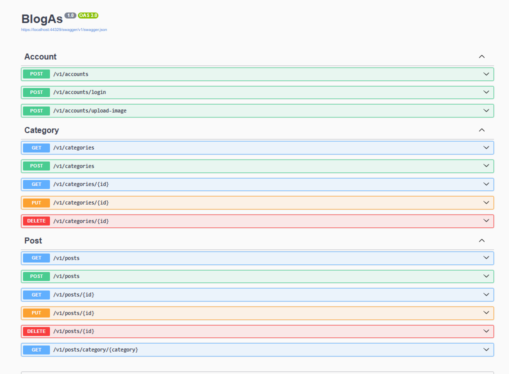

# 📰 BlogAPI - ASP.NET Core

## 📝 Descrição

API RESTful desenvolvida em **ASP.NET Core** com foco em **aprendizado e prática de construção de APIs**, realizando **CRUD de posts e categorias**, autenticação via **JWT** e envio de senhas de novos usuários por email.  
Ideal para **estudo de ASP.NET Core, EF Core, autenticação e boas práticas em APIs REST**.

## 🚀 Funcionalidades

- ✅ CRUD completo de **posts**
- ✅ CRUD completo de **categorias**
- ✅ **Autenticação JWT** com login e registro
- ✅ Envio de senha por **email para novos usuários**
- ✅ Validações robustas com **FluentValidation**
- ✅ Documentação automática via **Swagger**
- ✅ Paginação e filtragem de listagens

## 🛠️ Tecnologias utilizadas

- **ASP.NET Core**
- **Entity Framework Core**
- **SQL Server**
- **FluentValidation**
- **Swagger**
- **JWT Bearer Authentication**

## 🖼️ Print do Swagger

